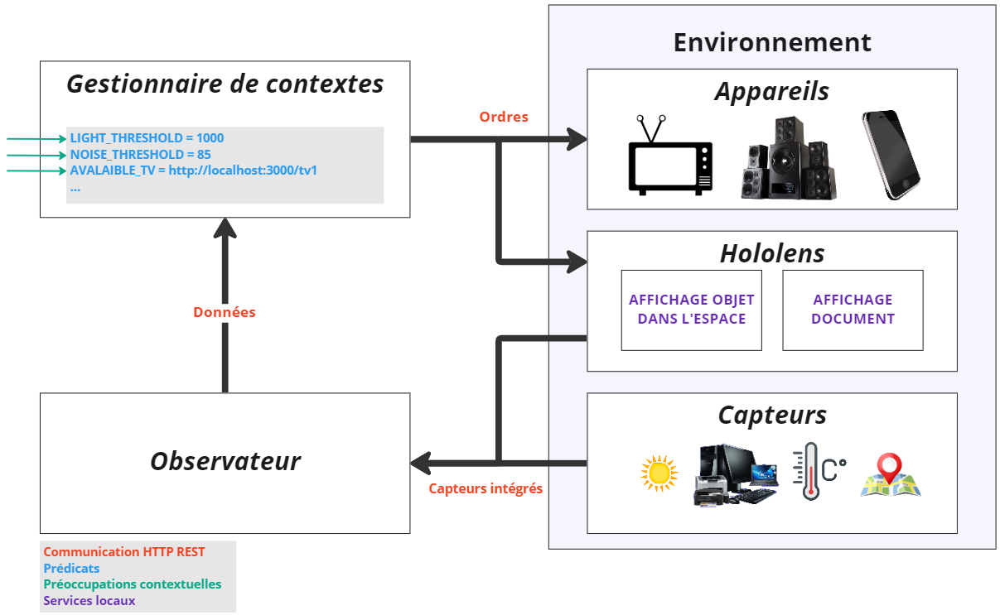

# Description

An application that communicates with an Hololens and will display the different elements of a task accordingly for the current context.

# Start the project

You need to start both the context-manager and the observer for the project to work, read the corresponding readme.md for instructions.

# Architecture

